# [TIL] 2024-04-03

## Many to One (N:1 or 1:N)
- 한 테이블의 0개 이상의 레코드가 다른 테이블의 레코드 한 개와 관련된 관계
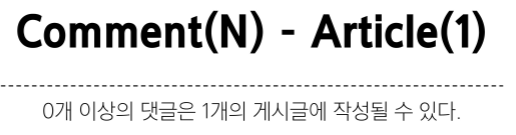
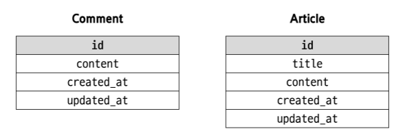
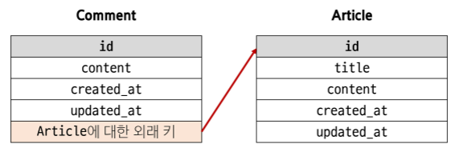

## 댓글 모델 정의
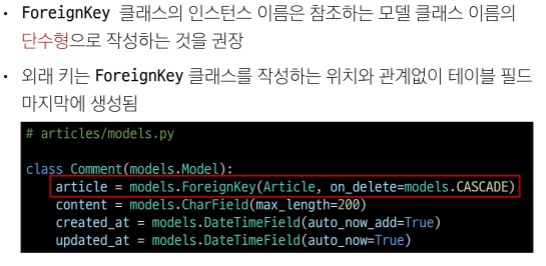
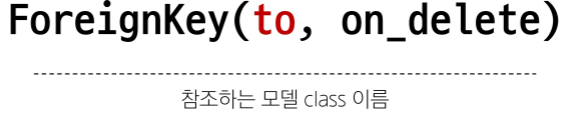
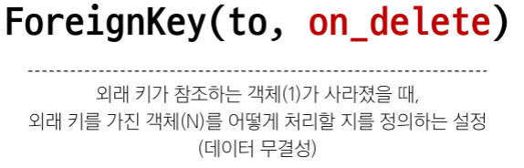
- on_delete의 'CASCADE'
    - 부모 객체(참조 된 객체)가 삭제 됐을 때 이를 참조하는 객체도 삭제

    ### 댓글 생성 연습
    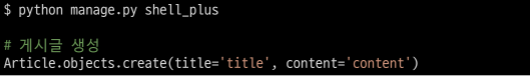
    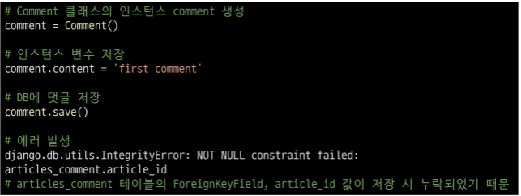
    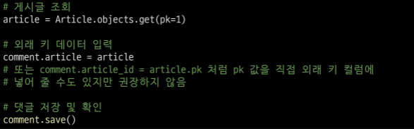
    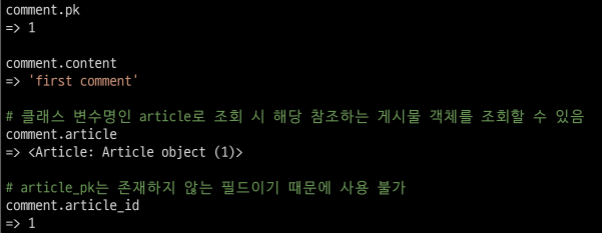
    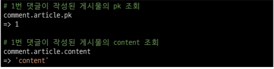
    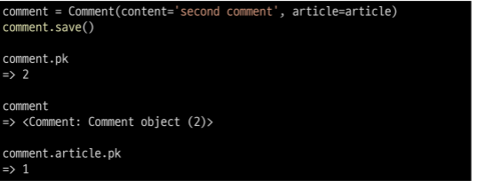
    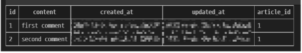

## 역참조
- N:1 관계에서 1에서 N을 참조하거나 조회하는 것
    - 1 -> N
    - N은 외래 키를 가지고 있어 물리적으로 참조가 가능하지만 1은 N에 대한 참조 방법이 존재하지 않아 별도의 역참조 기능이 필요
- 예시
    - 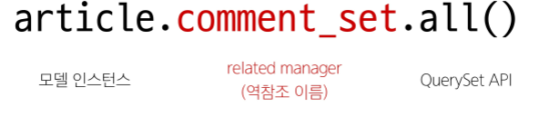
        - 특정 게시글에 작성된 댓글 전체를 조회하는 명령
- related manager
    - N:1 혹은 M:N 관계에서 역참조 시에 사용하는 매니저
        - 'objects' 매니저를 통해 QuerySet API를 사용했던 것처럼
        related manager를 통해  QuerySet API를 사용할 수 있게 됨
    ### 이름 규칙
    - 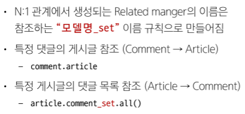
    ### 연습
    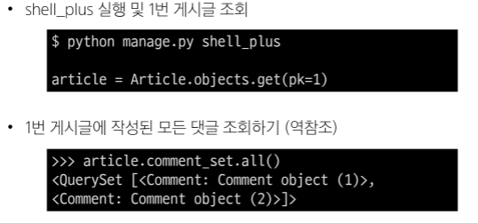
    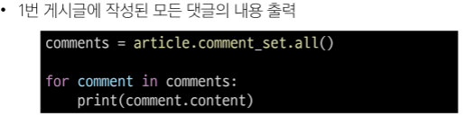
## 댓글 구현