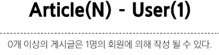
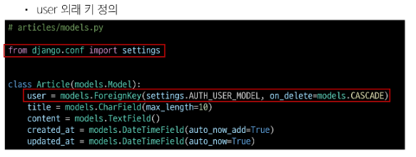
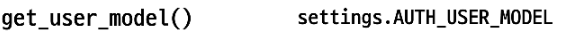
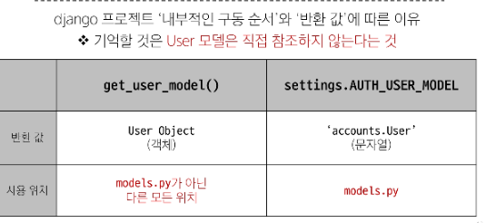
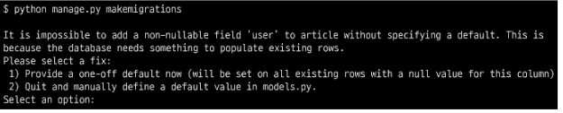
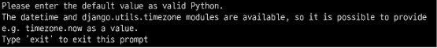

# [TIL] 2024-04-04

## Many to one 관계
- ### User와 다른 모델 간의 관계 설정
    
    1. User and Article
    2. User and Comment
### Article - User 모델 관계설정
- 외래키 정의 (get_user_model()로 직접 접근은 장고에서 권장하지 않음)

### User 모델을 참조하는 2가지 방법

### Migration

- 기존에 테이블이 있는 상황에서 필드를 추구하려하기 때문에 발생하는 과정
- 기본적으로 모든 필드에는 NOT NULL 제약조건이 있기 때문에 데이터가 없이는 새로운 필드가 추가되지 못함
- '1'을 입력하고 Enter 진행(다음 화면에서는 직접 기본 값 입력)

- 추가하는 외래키 필드에 어떤 데이터를 넣을 것인지 직접 입력해야함
- 마찬가지로 '1'을 입력하고 진행
- 기존에 작성된 게시글이 있다면 모두 1번 회원이 작성한 것으로 처리함
- python manage.py makemigrations , python manage.py migrate