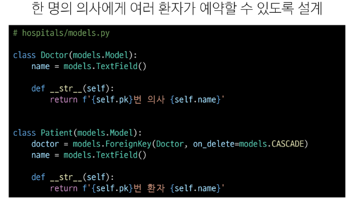

# [TIL] 2024-04-08

## Many to many
- 한 테이블의 0개 이상의 레코드가 다른 테이블의 0개 이상의 레코드와 관련된 경우 
- 양쪽 모두에서 N:1 관계를 가짐
    ### M:M 관계의 역할과 필요성 이해하기
    
    
    
    - 1번 환자가 두 의사 모드에게 진료를 받고자 한다면 환자 테이블에 1번 환자 데이터가 중복으로 입력될 수 밖에 없음
    
    - 동시에 예약을 못남기는가?
    
    - 동일한 환자지만 다른 의사에게도 진료 받기 위해 예약하기 위해서는 객체를 하나 더 만들어야 함
    - 외래키 컬럼에 '1,2' 형태로 저장하는 것은 DB 타입의 문제로 불가능
    - 예약 테이블을 따로 만들 것

    ### 중개 테이블
    1. 예약 모델 생성
        - 환자 모델의 외래키를 삭제하고 별도의 예약 모델을 새로 생성
        - 예약 모델은 의사와 환자에 각각 N:1 관계를 가짐
        
    2. 예약 데이터 생성
        
    3. 예약 정보 조회
        
    4. 추가 예약 생성
        
    ### 주요 사항
    