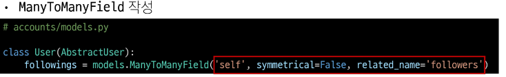
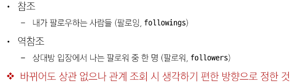
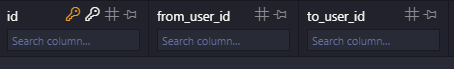
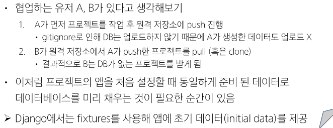
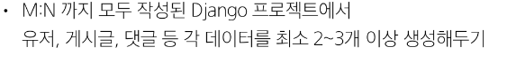
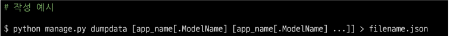
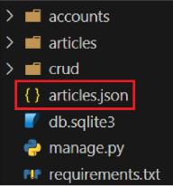
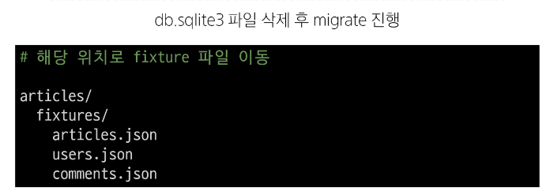
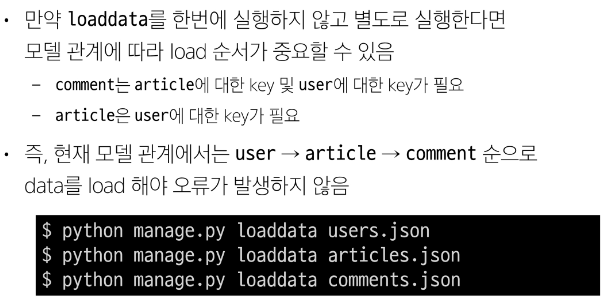

# [TIL] 2024-04-09

## 팔로우 기능 구현
    - User(M) - User(N)
        - 0명 이상의 회원은 0명 이상의 회원과 관련
        - 회원은 0명 이상의 팔로워를 가질 수 있고, 0명 이상의 다른 회원들을 팔로잉 할 수 있음
- 
- 

- 테이블 생성 결과
    
    - 참조 방향 : from -> to

## Fixtures
- Django가 DB로 가져오는 방법을 알고 있는 데이터 모음
- 데이터는 DB 구조에 맞추어 작성 되어 있음
- 사용 목적 : 초기 데이터 제공
- 초기 데이터의 필요성
    - 
- 사전준비
    
- 명령어 
    - dumpdata : 생성(데이터 추출)
    - loaddata : 로드(데이터 입력)

### dumpdata

- '>' 기준 왼쪽에 있는 값을 오른쪽의 filename.json 파일에 저장한다는 의미

- python manage.py dumpdata --indent 4 articles.article > articles.json
- python manage.py dumpdata --indent 4 accounts.user > users.json
- python manage.py dumpdata --indent 4 articles.comment > comments.json

### loaddata
- Fixtures 데이터를 DB로 불러오기
- 기본 경로 : app_name/fixtures/

- 주의 사항
    

### 모든 모델을 한번에 dump하기
- 3개의 모델을 하나의 json 파일로
    - python manage.py dumpdata --indent 4 articles.article articles.comment accounts.user > data.json
- 모든 모델을 하나의 json 파일로
    - python manage.py dumpdata --indent 4 > data.json
- 인코딩 에러 발생시 
    - dumpdata 시 추가 옵션 
        - python -Xutf8 manage.py dumpdata [생략]
    - 메모장 활용
        1. 메모장 json 파일 열기
        2. 다른 이름으로 저장 클릭
        3. 인코딩을 UTF-8로 선택 후 저장