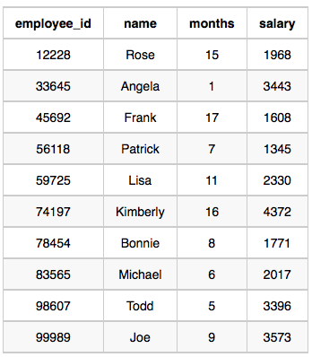

# [TIL] 2024-12-13.md
https://www.hackerrank.com/challenges/earnings-of-employees/problem
## Top Earners

We define an employee's total earnings to be their monthly salary x  months worked, and the maximum total earnings to be the maximum total earnings for any employee in the Employee table. Write a query to find the maximum total earnings for all employees as well as the total number of employees who have maximum total earnings. Then print these values as  2 space-separated integers.

Input Format

The Employee table containing employee data for a company is described as follows:

직원의 총 수입을 월 급여 x 개월 근무한 직원으로 정의하고, 최대 총 수입을 직원 표에 있는 모든 직원의 최대 총 수입으로 정의합니다. 모든 직원의 최대 총 수입과 최대 총 수입을 가진 직원의 총 수를 찾기 위해 쿼리를 작성합니다. 그런 다음 이 값을 공간으로 구분된 2개의 정수로 출력합니다.

입력 형식

회사의 직원 데이터가 포함된 직원 표는 다음과 같이 설명됩니다:


where employee_id is an employee's ID number, name is their name, months is the total number of months they've been working for the company, and salary is the their monthly salary.

Sample Input

여기서 employee_id는 직원의 ID 번호, 이름은 직원의 이름, 월은 회사에서 근무한 총 개월 수, 급여는 직원의 월급입니다.

샘플 입력



Sample Output
69952 1

Explanation

The table and earnings data is depicted in the following diagram: 

The maximum earnings value is 69952. The only employee with earnings=69952 is Kimberly, so we print the maximum earnings value 69952 and a count of the number of employees who have earned $69952 (which is 1) as two space-separated values.

설명.

표와 수익 데이터는 다음 다이어그램에 나와 있습니다:

최대 수익 가치는 69952입니다. 수익=69952인 유일한 직원은 킴벌리이므로 최대 수익 가치 69952와 $69952를 얻은 직원 수(1)의 카운트를 두 개의 공간으로 구분하여 출력합니다.

```SQL
SELECT months*salary as earnings , count(*)
FROM Employee 
group by earnings
order by earnings desc
limit 1
```

```SQL
SELECT months * salary AS earnings, COUNT(*)
FROM Employee
GROUP BY earnings
HAVING earnings = (SELECT MAX(months * salary) FROM Employee);
```
이 방식은 HAVING 조건으로 최대값만 필터링하므로 정렬이 필요 없다. -> 데이터 셋이 크다면 이득임
특정 조건을 추가하기에 적합하고, 다른 필터링 논리를 쉽게 적용할 수 있다.
다만 복잡성이 증가하고 서브쿼리 비용이 발생한다는 점이 단점임.

즉 데이터 크기가 작고 최댓값을 단순히 가져오는 방식이라면 LIMIT 사용이 더 효율적이라고 볼 수 있다.