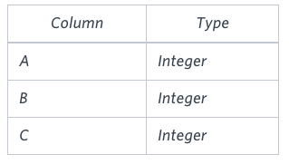
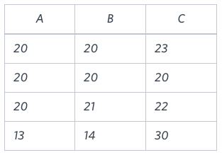

# [TIL] 2024-12-15

## CASE

```SQL
SELECT *, CASE
			WHEN categoryid = 1 THEN '음료'
            WHEN categoryid = 2 THEN '조미료' 
            ELSE '기타'
       END AS 'categoryName'
FROM Products
```

```SQL
SELECT CASE
			WHEN categoryid = 1 THEN '음료'
            WHEN categoryid = 2 THEN '조미료' 
            ELSE '기타'
       END AS 'categoryName', *
       --END AS 'categoryName', Products.*
FROM Products
```
- MySQL은 *(애스터리크)가 다른 컬럼뒤에 위치하는 것을 지원하지 않는다 그래서 Products.* 처럼 테이블 명을 앞에 붙여주면 해결된다.

### 조건 2가지를 만족하는 CASE문
```SQL
SELECT CASE
			WHEN categoryid = 1 AND SupplierId= 1 THEN '음료'
            WHEN categoryid = 2 THEN '조미료' 
            ELSE '기타'
       END AS 'categoryName', Products.*
FROM Products
```
- 비교 연산자(<,> 등) 뿐만 아니라 논리 연산자(and, or)도 사용할 수 있다.
- case 문으로 나온 결과 값을 그룹함수로도 활용 가능하다.

```SQL
SELECT CASE
			WHEN categoryid = 1 THEN '음료'
            WHEN categoryid = 2 THEN '소스' 
            ELSE '이외'
       END AS 'newCategory', AVG(Price)
FROM Products
GROUP BY newCategory
```
- newCategory로 그룹 매핑된 결과들의 평균 가격을 확인할 수 있다.

- 출력 결과
|newCategory|AVG(Price)|
|-----------|----------|
|소스|23.062500|
|음료|37.979167|
|이외|28.117170|

## Type of Triangle
Write a query identifying the type of each record in the TRIANGLES table using its three side lengths. Output one of the following statements for each record in the table:

Equilateral: It's a triangle with 3 sides of equal length.
Isosceles: It's a triangle with  2 sides of equal length.
Scalene: It's a triangle with 3 sides of differing lengths.
Not A Triangle: The given values of A, B, and C don't form a triangle.
Input Format

The TRIANGLES table is described as follows:

삼각형 테이블의 세 변 길이를 사용하여 각 레코드의 유형을 식별하는 쿼리를 작성합니다. 테이블의 각 레코드에 대해 다음 문장 중 하나를 출력합니다:

정삼각형: 세 변의 길이가 같은 삼각형입니다.
이등변: 두 변의 길이가 같은 삼각형입니다.
스칼렌: 길이가 다른 세 변을 가진 삼각형입니다.
삼각형이 아닙니다: 주어진 A, B, C 값은 삼각형을 형성하지 않습니다.
입력 형식

삼각형 표는 다음과 같이 설명됩니다:


Each row in the table denotes the lengths of each of a triangle's three sides.

Sample Input

표의 각 행은 삼각형의 세 변 각각의 길이를 나타냅니다.

샘플 입력



Sample Output

Isosceles
Equilateral
Scalene
Not A Triangle

Explanation

Values in the tuple (20,20,30) form an Isosceles triangle, because A=B.
Values in the tuple (20,20,20)  form an Equilateral triangle, because A=B=C . Values in the tuple (20,21,22)  form a Scalene triangle, because A!=B!=C .
Values in the tuple (13,14,30) cannot form a triangle because the combined value of sides A  and  B is not larger than that of side C.

튜플(20, 20, 30)의 값은 A=B이기 때문에 이등변 삼각형을 형성합니다.
튜플(20, 20, 20)의 값은 A=B=C이기 때문에 정삼각형을 형성합니다. 튜플(20, 21, 22)의 값은 A!=B!=C이기 때문에 스칼렌 삼각형을 형성합니다.
튜플(13,14,30)의 값은 변 A와 변 B의 합이 변 C의 합보다 크지 않기 때문에 삼각형을 형성할 수 없습니다.

```SQL
SELECT CASE
            WHEN A = B AND B = C THEN 'Equilateral'
            
            WHEN ((A+B) <= C or (A+C) <= B or (B+C) <= A) THEN 'Not A Triangle'
            WHEN A = B OR B = C or C = A THEN 'Isosceles'
            WHEN A != B AND B != C AND A!= C THEN 'Scalene'
        END
FROM TRIANGLES
```
- WHEN THEN의 순서가 매우 중요하다 (Java If와 동일함)

## CASE를 활용한 테이블 피벗

```SQL
SELECT CASE WHEN categoryId = 1 THEN price ELSE NULL END AS category1_price, Products.*
FROM Products
```
```SQL
SELECT AVG(CASE WHEN categoryId = 1 THEN price ELSE NULL END) AS category1_price,
AVG(CASE WHEN categoryId = 2 THEN price ELSE NULL END) AS category2_price,
AVG(CASE WHEN categoryId = 3 THEN price ELSE NULL END) AS category3_price
FROM Products
```

|category1_price|category2_price|category3_price|
|-|-|-|
|37.979167|23.062500|25.160000|

## 리트코드

# SQL 문제: 부서 테이블 재포맷

## **문제 설명**

다음과 같은 구조의 `Department` 테이블이 주어집니다:

### 테이블: Department

| Column Name | Type    |
|-------------|---------|
| id          | int     |
| revenue     | int     |
| month       | varchar |

- `(id, month)`는 이 테이블의 기본 키입니다.
- 이 테이블은 각 부서의 월별 수익 정보를 포함하고 있습니다.
- `month` 열은 다음 값 중 하나를 가질 수 있습니다: `["Jan", "Feb", "Mar", "Apr", "May", "Jun", "Jul", "Aug", "Sep", "Oct", "Nov", "Dec"]`.

### 작업

- 매달 **부서 ID 열과 수익 열**이 있도록 테이블을 재포맷합니다.
- 결과 테이블은 **아무 순서로 반환**해도 괜찮습니다.

---

## **입력**

### 입력 예시 테이블: Department

| id   | revenue | month |
|------|---------|-------|
| 1    | 8000    | Jan   |
| 2    | 9000    | Jan   |
| 3    | 10000   | Feb   |
| 1    | 7000    | Feb   |
| 1    | 6000    | Mar   |

---

## **출력**

### 출력 예시 테이블:

| id   | Jan_Revenue | Feb_Revenue | Mar_Revenue | ... | Dec_Revenue |
|------|-------------|-------------|-------------|-----|-------------|
| 1    | 8000        | 7000        | 6000        | ... | null        |
| 2    | 9000        | null        | null        | ... | null        |
| 3    | null        | 10000       | null        | ... | null        |

- **설명**:
  - `Apr`부터 `Dec`까지의 수익은 `null`입니다.
  - 결과 테이블에는 13개의 열(부서 ID 1개 + 월별 열 12개)이 있습니다.

```SQL
SELECT id,
    SUM(CASE WHEN month = 'Jan' THEN revenue ELSE NULL END) AS Jan_Revenue,
    SUM(CASE WHEN month = 'Feb' THEN revenue ELSE NULL END) AS Feb_Revenue,
    SUM(CASE WHEN month = 'Mar' THEN revenue ELSE NULL END) AS Mar_Revenue,
    SUM(CASE WHEN month = 'Apr' THEN revenue ELSE NULL END) AS Apr_Revenue,
    SUM(CASE WHEN month = 'May' THEN revenue ELSE NULL END) AS May_Revenue,
    SUM(CASE WHEN month = 'Jun' THEN revenue ELSE NULL END) AS Jun_Revenue,
    SUM(CASE WHEN month = 'Jul' THEN revenue ELSE NULL END) AS Jul_Revenue,
    SUM(CASE WHEN month = 'Aug' THEN revenue ELSE NULL END) AS Aug_Revenue,
    SUM(CASE WHEN month = 'Sep' THEN revenue ELSE NULL END) AS Sep_Revenue,
    SUM(CASE WHEN month = 'Oct' THEN revenue ELSE NULL END)AS Oct_Revenue,
    SUM(CASE WHEN month = 'Nov' THEN revenue ELSE NULL END) AS Nov_Revenue,
    SUM(CASE WHEN month = 'Dec' THEN revenue ELSE NULL END) AS Dec_Revenue
FROM Department
GROUP BY id
```
-집계 함수(SUM 또는 MAX)를 사용하는 이유는:

	1.	GROUP BY로 그룹화한 후, 각 그룹에 대해 단일 값을 반환하기 위해.
	2.	단일 값만 존재할 경우, SUM과 MAX 모두 동일한 결과를 제공.
	3.	집계 함수 없이는 오류 발생: SQL은 그룹화된 여러 값 중 어떤 것을 반환할지 결정할 수 없음.

