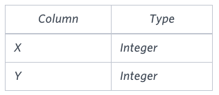
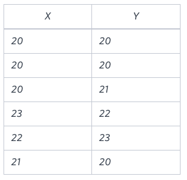

# [TIL] 2024-12-17

## Employees Earning More Than Their Managers
### SELF JOIN
[https://leetcode.com/problems/employees-earning-more-than-their-managers/]


| Column Name | Type    |
|-------------|---------|
| id          | int     |
| name        | varchar |
| salary      | int     |
| managerId   | int     |

- `id` is the primary key for the table.
- Each row represents an employee, their name, salary, and the ID of their manager.
- Your task is to find the employees who earn more than their managers.

- 'id'는 테이블의 기본 키입니다.
- 각 행은 직원, 그들의 이름, 급여, 그리고 관리자의 신분증을 나타냅니다.
- 당신의 임무는 관리자보다 더 많은 수입을 올리는 직원들을 찾는 것입니다.

### Input:
Employee table:

| id | name  | salary | managerId |
|----|-------|--------|-----------|
| 1  | Joe   | 70000  | 3         |
| 2  | Henry | 80000  | 4         |
| 3  | Sam   | 60000  | Null      |
| 4  | Max   | 90000  | Null      |

### Output:
| Employee |
|----------|
| Joe      |

### Explanation:
- Joe's salary is `70000`, and his manager (id = 3) earns `60000`.
- Joe earns more than his manager.
- Henry and others do not satisfy this condition.

- Joe의 연봉은 '70000'이고, 그의 매니저(ID = 3)는 '60000'을 받습니다.
- 조는 매니저보다 더 많은 돈을 벌고 있습니다.
- 헨리와 다른 사람들은 이 조건을 충족하지 못합니다.

```SQL
SELECT Employee.Name AS Employee
FROM Employee
    INNER JOIN Employee AS Manager ON Employee.managerId = Manager.id
where Employee.Salary > Manager.Salary 
```


## Find Dates with Higher Temperatures Compared to Previous Day

You are given a table named `Weather` with the following structure:

| Column Name   | Type    |
|---------------|---------|
| id            | int     |
| recordDate    | date    |
| temperature   | int     |

- `id` is the column with unique values.
- Each row represents the temperature recorded on a specific `recordDate`.
- There are no duplicate rows with the same `recordDate`.

- 'id'는 고유한 값을 가진 열입니다.
- 각 행은 특정 '기록 날짜'에 기록된 온도를 나타냅니다.
- 동일한 '기록 날짜'를 가진 중복 행은 없습니다.

Your task is to find the `id` of all dates where the temperature is **higher** compared to the previous date (yesterday).

당신의 임무는 이전 날짜(어제)와 비교하여 온도가 **더 높은**인 모든 날짜의 'id'를 찾는 것입니다.

## Example

### Input:
Weather table:

| id | recordDate | temperature |
|----|------------|-------------|
| 1  | 2015-01-01 | 10          |
| 2  | 2015-01-02 | 25          |
| 3  | 2015-01-03 | 20          |
| 4  | 2015-01-04 | 30          |

### Output:
| id |
|----|
| 2  |
| 4  |

### Explanation:
- On `2015-01-02`, the temperature increased from `10` (previous day) to `25`.
- On `2015-01-04`, the temperature increased from `20` (previous day) to `30`.

- '2015-01-02'의 온도는 전날 '10'에서 '25'로 상승했습니다.
- '2015-01-04'에는 전날의 기온이 '20'에서 '30'으로 상승했습니다.

```SQL
SELECT today.id
FROM Weather AS today
    INNER JOIN Weather AS yesterday ON yesterday.id + 1 = today.id
WHERE today.temperature > yesterday.temperature
```
- 이 풀이는 날짜가 db에 순서대로 저장되어 있을때만 가능하다.

DATE_ADD를 통해 날짜를 더해주기
```SQL
SELECT today.id
FROM Weather AS today
    INNER JOIN Weather AS yesterday 
    ON DATE_ADD(yesterday.recordDate, INTERVAL 1 DAY) = today.recordDate
WHERE today.temperature > yesterday.temperature 
```

DATEDIFF를 사용해 두 날짜의 차이 이용하기
```SQL
SELECT today.id AS id
FROM Weather AS today
JOIN Weather AS yesterday
ON DATEDIFF(today.recordDate, yesterday.recordDate) = 1
WHERE today.temperature > yesterday.temperature;
```

<br>

# MySQL 날짜 관련 함수 정리
## **1. 날짜 더하기 / 빼기**

### **`DATE_ADD`**
특정 날짜에 **일, 월, 연도 등**을 더할 때 사용합니다.

**문법**:
```sql
DATE_ADD(date, INTERVAL value unit)
```

date: 기준 날짜
value: 더하거나 뺄 값
unit: DAY, MONTH, YEAR, HOUR, MINUTE, SECOND
예제:
```SQL
SELECT DATE_ADD('2024-06-01', INTERVAL 1 DAY);
-- 결과: 2024-06-02
```
DATE_SUB
특정 날짜에서 일, 월, 연도 등을 뺄 때 사용합니다.

문법:
```SQL
DATE_SUB(date, INTERVAL value unit)
```
예제:
```SQL
SELECT DATE_SUB('2024-06-01', INTERVAL 1 DAY);
-- 결과: 2024-05-31
```

## 2. 날짜 차이
**`DATEDIFF`**

두 날짜 사이의 일(day) 단위 차이를 반환합니다.

문법:
```SQL
DATEDIFF(date1, date2)
```
예제:
```SQL
SELECT DATEDIFF('2024-06-02', '2024-06-01');
-- 결과: 1
```

## 3. 날짜 포맷팅
**`DATE_FORMAT`**

날짜를 원하는 포맷 문자열로 변환합니다.

문법:
```SQL
DATE_FORMAT(date, format)
```

format 예시:
- %Y: 연도 (4자리)
- %m: 월 (2자리)
- %d: 일 (2자리)
- %H: 시간 (24시간 형식)
- %i: 분
- %s: 초

예제:
```SQL
SELECT DATE_FORMAT('2024-06-01', '%Y-%m-%d');
-- 결과: 2024-06-01
```

## 4. 날짜에서 특정 값 추출
**`YEAR, MONTH, DAY`**

날짜에서 연도, 월, 일을 각각 추출합니다.

문법:
```SQL
YEAR(date)    -- 연도 추출
MONTH(date)   -- 월 추출
DAY(date)     -- 일 추출
```
예제:
```SQL
SELECT YEAR('2024-06-01'), MONTH('2024-06-01'), DAY('2024-06-01');
-- 결과: 2024, 6, 1
```

## 5. 날짜 비교
단순 날짜 비교 연산
날짜는 =, <, >, <=, >= 연산자를 사용해서 비교할 수 있습니다.

예제:
```SQL
SELECT *
FROM Weather
WHERE recordDate = '2024-06-01';

SELECT *
FROM Weather
WHERE recordDate > '2024-06-01';
```

## 6. 현재 날짜와 시간
**`CURDATE() / CURRENT_DATE()`**

현재 날짜를 반환합니다.

예제:
```SQL
SELECT CURDATE();
-- 결과: 2024-06-02 (오늘 날짜 기준)
```

**`NOW()`**

현재 날짜와 시간을 반환합니다.

예제:
```SQL
SELECT NOW();
-- 결과: 2024-06-02 15:30:00 (현재 시간 기준)
```

**`CURRENT_TIMESTAMP`**

현재 타임스탬프를 반환합니다.

예제:
```SQL
SELECT CURRENT_TIMESTAMP;
-- 결과: 2024-06-02 15:30:00
```


## 집합연산 UNION
`Users_recnet`

|로그인 아이디|연락처|주소|
|-|-|-|
|A|010-****-4679|광진구 자양동|
|B|010-****-7700|송파구 석촌동|


`Users_past`

|로그인 아이디|연락처|주소|
|-|-|-|
|C|010-****-4676|분당구 판교동|
|B|010-****-7700|송파구 석촌동|


`UNOIN 결과`
|로그인 아이디|연락처|주소|
|-|-|-|
|A|010-****-4679|광진구 자양동|
|B|010-****-7700|송파구 석촌동|
|C|010-****-4676|분당구 판교동|

중복 데이터가 있을 경우 중복을 제거한 결과를 반환한다.

## UNION ALL

`Users_recnet`

|로그인 아이디|연락처|주소|
|-|-|-|
|A|010-****-4679|광진구 자양동|
|B|010-****-7700|송파구 석촌동|


`Users_past`

|로그인 아이디|연락처|주소|
|-|-|-|
|C|010-****-4676|분당구 판교동|
|B|010-****-7700|송파구 석촌동|


`UNOIN ALL 결과`
|로그인 아이디|연락처|주소|
|-|-|-|
|A|010-****-4679|광진구 자양동|
|B|010-****-7700|송파구 석촌동|
|C|010-****-4676|분당구 판교동|
|B|010-****-7700|송파구 석촌동|

중복 데이터가 있을 경우 중복을 포함한 결과를 반환한다.

## 예제
- Products 테이블에서 Price가 5이하 또는 200이상인 상품들만 출력하세요
```SQL
SELECT *
FROM Products
WHERE price <= 5
OR price >= 200
```
UNION으로 작성한 쿼리
```SQL
SELECT *
FROM Products
WHERE price <= 5

UNION

SELECT *
FROM Products
WHERE price >=200
```

- EXCEPT를 사용하면 윗 테이블 - 아랫 테이블 (MySQL에서 지원x)

## 만약 비회원 주문이 있는 경우라면?
- Orders에는 정보가 있지만 Customers에는 정보가 없을 수 있다.
- 이런 경우는 어떻게 해야하는가?
```SQL
-- 고객 정보는 있지만 주문 정보는 없을 때
SELECT *
FROM Customers
	LEFT JOIN Orders ON Customers.CustomerID = Orders.CustomerID

UNION

-- 주문 정보는 있지만 고객 정보는 없을 때
SELECT *
FROM Customers
	RIGHT JOIN Orders ON Customers.CustomerID = Orders.CustomerID
```
`FULL OUTER JOIN` 이라고 한다. -> MySQL 지원이 안되어서 UNION으로 LEFT, RIGHT를 합쳐준다.

`FULL OUTER JOIN`의 문법
```SQL
SELECT * FROM TableA A
FULL OUTER JOIN TableB B ON A.key = B.key
```

## Symmetric Pairs
[https://www.hackerrank.com/challenges/symmetric-pairs/problem]

You are given a table, Functions, containing two columns: X and Y.

함수라는 두 개의 열이 포함된 표가 주어집니다: X와 Y.



Two pairs (X1, Y1) and (X2, Y2) are said to be symmetric pairs if X1 = Y2 and X2 = Y1.

Write a query to output all such symmetric pairs in ascending order by the value of X. List the rows such that X1 ≤ Y1.

두 쌍(X1, Y1)과 (X2, Y2)는 X1 = Y2이고 X2 = Y1일 때 대칭 쌍이라고 합니다.

쿼리를 작성하여 모든 대칭 쌍을 X 값만큼 오름차순으로 출력합니다. X1 ≤ Y1이 되도록 행을 나열합니다.

Sample Input


Sample Output

20 20
20 21
22 23


```SQL
SELECT X, Y
FROM Functions
WHERE X = Y
GROUP BY X,Y
HAVING COUNT(*) = 2

UNION

SELECT f1.x, f1.y
FROM Functions AS f1
    INNER JOIN Functions AS f2 ON f1.x = f2.y AND f1.y = f2.x
WHERE f1.x < f1.y
ORDER BY X
```
- 주의할 점
    - UNION으로 합친 테이블을 정렬할 때에는 아래의 쿼리문에만 ORDER BY를 사용할 수 있고 그 기준은 합쳐진 테이블 전체의 컬럼을 기준으로 한다
    - 여기선 X가 된다.