# [TIL] 2024-04-25

## Frontend Development
- 웹 사이트와 웹 애플리케이션의 사용자 UI와 UX을 만들고 디자인하는 것
- HTML,CSS,JacaScript 등을 활용하여 사용자가 직접 상호 작용하는 부분을 개발

## Client-side frameworks
- 클라이언트 측에서 UI와 상호작용을 개발하기 위해 사용되는 JavaScript 기반 프레임워크
## Client-side frameworks 필요한 이유
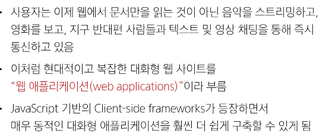
- 웹에서 하는 일이 많아 졌다
    - 다루는 데이터가 많아짐
- Vanilla JS 만으로는 처리가 쉽지 않다.
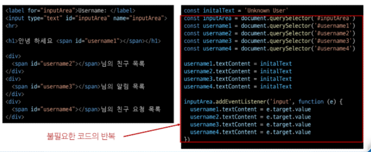

## Single Page Application (SPA)
- 단일 페이지로 구성된 애플리케이션
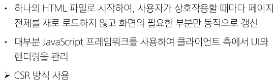

## Client-side Rending(CSR)
- 클라이언트에서 화면을 렌더링 하는 방식
## CSR 동작 과정
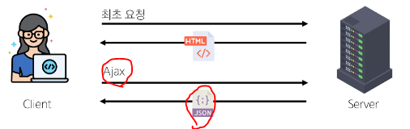
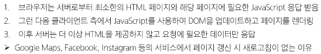
## CSR 장점
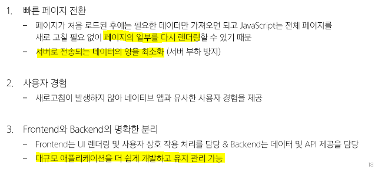
## CSR 단점
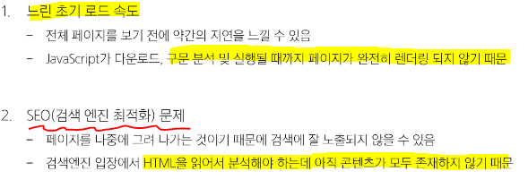
## SPA vs .MPA / CSR cs .SSR
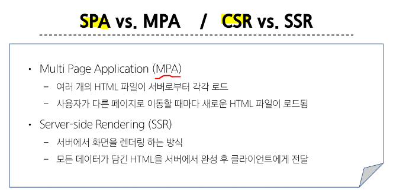

## vue의 2가지 핵심 기능
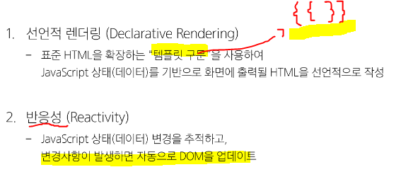

## Vue 사용 방법 - CDN
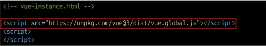
1. cdn 작성
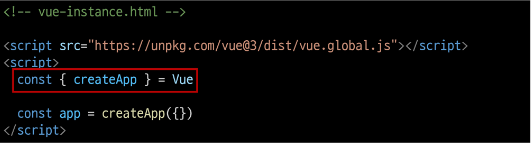
2. 전역 Vue 객체
    - CDN에서 Vue를 사용하는 경우 전역 Vue 객체 불러옴
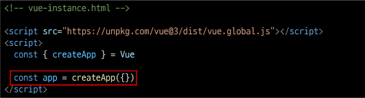
3. Application instance
    - 모든 Vue 애플리케이션은 createApp 함수로
    새 Application instance를 생성하는 것으로 시작
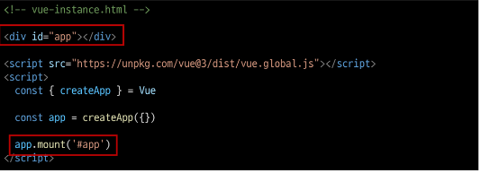
4. app.mount()
    - HTML 요소에 Vue 애플리케이션 인스턴스를 탑재(연결)
    - 각 앱 인스턴스에 대해 mount()는 한번만 호출 가능

## ref()
- 반응형 상태(데이터)를 선언하는 함수
(Declaring Reactive State)
- value 속성이 있는 ref 객체로 래핑하여 반환하는 함수
- ref로 선언된 변수의 값이 변경되는 템플릿에서 자동 업데이트
- 인자는 어떤 타입도 가능
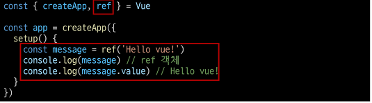
- 템플릿의 참조에 접근하려면 setup 함수에서 선언 및 반환 필요
- 편의상 템플릿에서 ref를 사용할 때는 .value를 작성할 필요가 없음
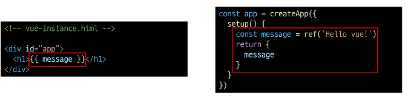
- 반응형을 가지는 참조 변수를 만드는 것
    - (ref === reactive reference)

## Vue 기본구조
- createApp()에 전달되는 객체는 Vue 컴포넌트(Component)
- 컴포넌트의 상태는 setup() 함수 내에서 선언되어야 하며 객체를 반환해야함
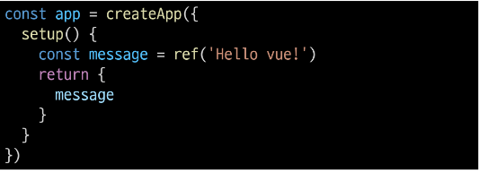

## 템플릿 렌더링
- 반환된 객체의 속성은 템플릿에서 사용할 수 있음
- Mustache syntax(콧수염 구문)를 사용하여 메시지 값을 기반으로 동적 텍스트 렌더링
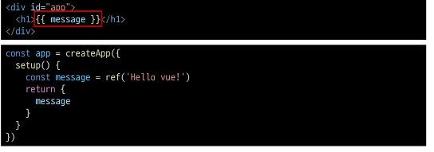
- 콘텐츠는 식별자나 경로에만 국한되지 않으며 유효한 JavaScript 표현식을 사용할 수 있음

## 템플릿에서 unwrap시 주의사항
1. 템플릿에서 unwrap은 ref가 최상위 속성인 경우만 적용 가능