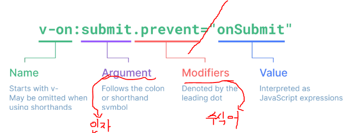

# [TIL] 2024-04-29

## Template Syntax
- DOM을 기본 구성 요소 인스턴스의 데이터에 선언적으로 바인딩할 수 있는 HTML 기반 템플릿 구문을 사용

## 종류
1. Text Interpolation

    - 데이터 바인딩의 가장 기본적인 형태
    - 이중 중괄호 문(콧수염 구문)을 사용
    - 콧수염 구문은 해당 구성 요소 인스턴스의 msg 속성 값으로 대체
    - msg 속성이 변경될 때마다 업데이트 됨

2. Raw HTML

- 콧수염 구문은 데이터를 일반 텍스트로 해석하기 떄문에 실제 HTML을 출력하려면 v-html을 사용해야함
3. Attribute Bindings

- 콧수염 구문은 HTML 속성 내에서 사용할 수 없기 때문에 v-bind를 사용
- HTML의 id 속성 값을 vue의 dynamicId 속성과 동기화 되도록 함
- 바인딩 값이 null이나 undefind인 경우 렌더링 요소에서 제거 된다.
4. JavaScript Expressions

- Vue는 모든 데이터 바인딩 내에서 JavaScript 표현식의 모든 기능을 지원
- Vue 템플릿에서 JavaScript 표현식을 사용할 수 있는 위치
    1. 콧수염 구문 내부
    2. 모든 directive의 속성 값
    ("v-"로 시작하는 특수 속성)

## 주의 사항

- 각 바인딩에는 하나의 단일 표현식만 포함 가능
    - 표현식은 값으로 평가할 수 있는 코드 조각(*return 뒤에 사용할 수 있는 코드여야 함*) 
- 작동하지 않는 경우
    - if 문을 사용하려면 삼항 연산자를 사용해야 한다.

## Directive
- 'v-' 접두사가 있는 특수 속성

## 특징

- "" 공간은 JavaScript 구문의 영역이 된다.

## 전체 구문

- 위의 구문은 어떠한 이벤트 핸들러(submit)이 발생할 대 submit 이벤트의 기본 동작을 취소하겠다는 의미
- onSubmit = 어떠한 동작을 하는 함수일 것이다.

- submit은 v-on의 Argument이기 때문에 들어오는 것이지 다른 디렉티브 마다 Argument가 달라진다.
- 모든 디렉트브가 인자와 수식어를 가지는 것은 아니다.

## Directive - "Arguments"

- 바인딩 한다 => 연결한다 정도로 이해하면 될 듯.
## Directive - "Modifiers"

- 수식어라고도 한다.
- @submit x -> v-on이다.
- .prevent => event.preventDefault()를 사용한 것과 동일한 효과 

## Built-in Directive
- v-text
- v-show
- v-if
- v-for 
- ..등등

## v-bind
- 하나 이상의 속성(HTML의 속성) 또는 컴포넌트(Vue 인스턴스) 데이터를 표현식(JavaScript 표현식)에 동적으로 바인딩
## 사용처
1. Attribute Bindings
    - src, href ....

- 변수명을 바꾼다고 생각하면 좋을 듯(아래 사진 참고)

2. Class and Style Bindings
- class, style 속성 

- 여러개의 값을 설정하기 위해 객체 혹은 배열을 사용하는 것이 좋다.

## Class and Style Bindings가 가능한 경우
1. Binding HTML Classes
    - Binding to Objects
    
    
    
    - Binding to Arrays
    
    
    

2. Binding Inline Styles
    - Binding to Objects
    
    
    
    - Binding to Arrays
    

## v-on
- DOM 요소에 이벤트 리스너를 연결 및 수신
- v-on:event="handler"
- handler 종류
    - Inline handlers : 이벤트가 트리거가 될 때 실행 될 JavaScript 코드
    - Method handlers : 컴포넌트에 정의된 메서드 이름
- v-on 약어
    - '@'
    - @event="handler"

## Event Modifiers

- 수식어를 작성한 순서대로 동작하기 때문에 작성시 순서에 유의한다.
- 여기서 .stop은 무엇을 의미하는가?
    - 클릭 이벤트 전파가 중지된다 (레퍼런스)
    - 
        - 전파 => 버블링에서 배웠음
        - 모든 이벤트는 상위로 전달되는 전파 현상이 발생함
    - 
        - 클릭 이벤트 전파가 중지
        - a태그의 기본동작(해당 url로 이동하는 것)도 막겠다.

## Key Modifiers
- vue는 키보드 이벤트를 수신할 때 특정 키에 관한 별도 modifiers를 사용할 수 있다
- 예시 
    - <input @keyup.enter="onSubmit">
    - key가 enter 일 때만 onSubmit 이벤트를 호출하기

## Form Input Bindings
- form을 처리할 때 사용자가 input에 입력하는 값을
실시간으로 JavaScript 상태에 동기화해야 하는 경우 (양방향 바인딩)
    - 사용자 입력 값 <-> 반응형 변수
- 양방향 바인딩
1. v-bind와 v-on을 함께 사용

2. v-model 사용

## v-model
- form input 요소 또는 컴포넌트에서 양방향 바인딩을 만듦
## v-model 사용

## v-model과 다양한 입력 양식
- v-model은 단순 Text input 뿐만 아니라 Checkbox,Radio, Select등 다양한 타입의 사용자 입력 방식과 함께 사용 가능하다.
## Checkbox

- 단일 체크 박스 클릭시 변화

- 배열 활용

    - 기본
    
    - Alice 체크
    
    - Bella 체크
    
    - 둘 다 체크
    
    

## Select 활용

- option 태그에 연결하는 것이 아니라 option을 가지고 있는 select 태그에 v-model을 연결한느 것이다.

## 참고
### '$' 접두어가 붙은 변수
- Vue 인스턴스 내에서 제공되는 내부 변수
-  사용자가 지정한 반응형 변수나 메서드와 구분하기 위함 
- 주로 Vue 인스턴스 내부 상태를 다룰 때 사용