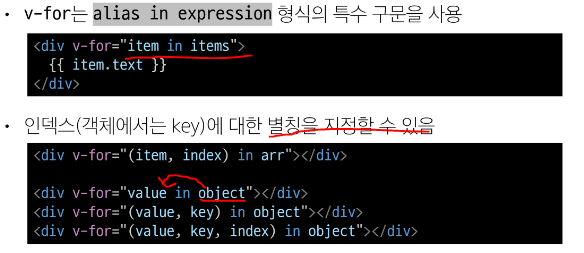
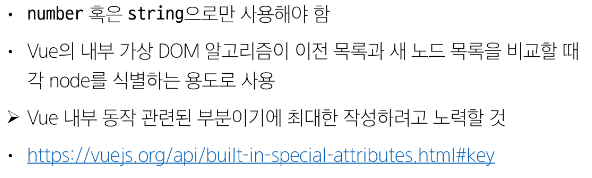
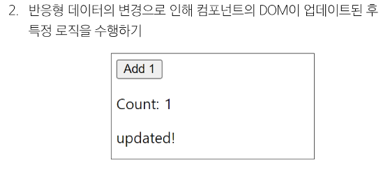

# [TIL] 2024-04-30

## Computed
- 계산된 속성을 정의하는 함수
- 미리 계산된 속성을 사용하여 템플릿에서 표현식을 단순하게 하고 불필요한 반복 연산을 줄임

## 기본예시

## 특징

## computed와 동일한 로직을 처리할 수 있는 method

## computed와 method 차이

## Cache(캐시)

## 예시

## 적절한 사용처

## 정리

## Conditional Rendering
- v-if
    - 표현식 값의 true/false를 기반으로 요소를 조건부로 렌더링
## 예시

## 여러 요소에 대한 v-if 적용

## HTML <tmeplate> element

## v-if와 v-show
- v-show
    - 표현식 값의 true/false를 기반으로 요소의 가시성(visibiliy)을 전환
## 예시

## 적절한 사용처

## List Rendering
## v-for
- 소스 데이터를 기반으로 요소 또는 템플릿 블록을 여러번 렌더링
## 구조

## 여러 요소에 대한 v-for 적용

## 중첩

## 스타일 가이드 규칙

## 동일 요소에 v-for와 v-if를 함께 사용하지 않는다.

## 문제상황

## 해결법 2가지

## watch()
- 하나 이상의 반응형 데이터를 감시하고 감시하는 데이터가 변경되면 콜백 함수 호출

## 구조

## 기본동작

## 예시

## 여러 source를 감시하는 whatch

## Computed와 Whachers

## Lifecycle Hooks
- Vue 인스턴스의 생애주기 동안 특정 시점에 실행되는 함수

## Lifecycle Hooks Diagram
before created
1. create
    - 인스턴스 생성 -> 태어남
before mount
2. mount
    - 인스턴스 부착 -> dom
before update
3. update
    - 인스턴스 상태 변함
before unmount
4. unmount
    - 인스턴스가 떨어짐

## 예시

## 특징

## Style guide

## 참고
      