# [TIL] 2024-05-02
## Component
- 재사용 가능한 코드 블록
## 특징
- UI를 독립적이고 재사용 가능한 일부분으로 분할하고 각 부분을 개별적으로 다룰 수 있음
- 자연스럽게 애플리케이션은 중첩된 Component의 트리 형태로 구성된다.
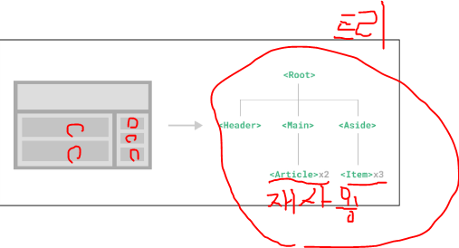
## Single-File Components(SFC)
- 컴포넌트의 템플릿, 로직 및 스타일을 하나의 파일로 묶어낸 특수한 파일 형식 (*.vue 파일)
## 예시
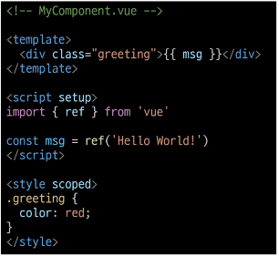
- Vue SFC는 HTML, CSS, JavaScript를 단일 파일로 합친 것
- <template>, <script>, <style> 블록은 하나의 파일에서 컴포넌트의 뷰, 로직 및 스타일을 독립적으로 배치

## 문법
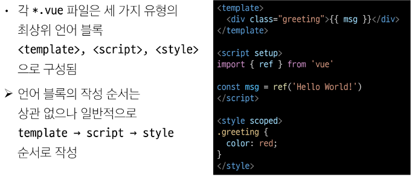

## template
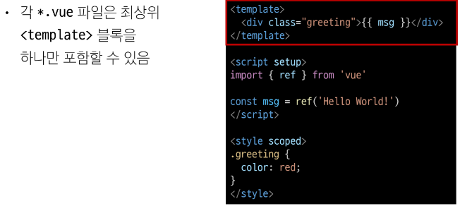

## script
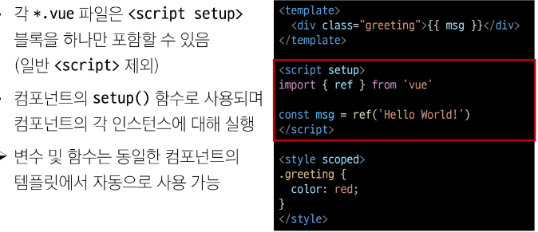
- setup이 붙은 script만 1개 가능

## style
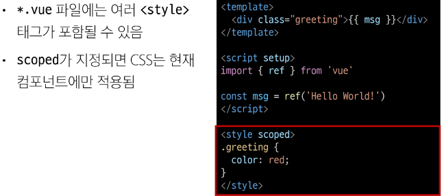

## 컴포넌트 사용하기
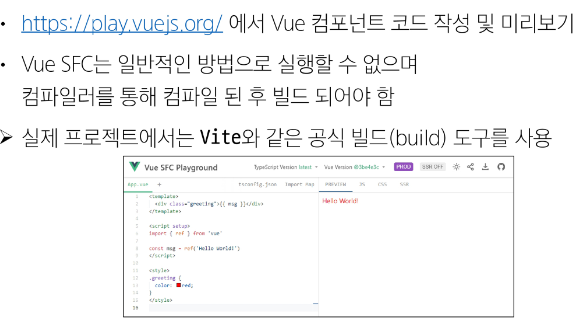

## Build
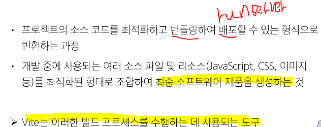

## NPM
- Node Package Manager

## Node.js의 영향
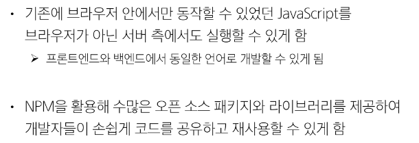

## Module
- 프로그램을 구성하는 독립적인 코드 블록(*.js파일)
## Module 의 필요성 
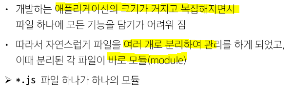
## 한계
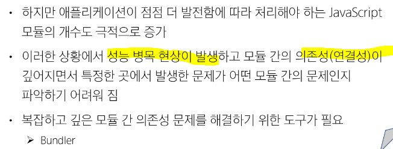

## Bundler
- 여러 모듈과 파일을 하나(혹은 여러 개)의 번들로 묶어 최적화하여 애플리케이션에서 사용할 수 있게 만들어 주는 도구
## 역할

## node_moduls
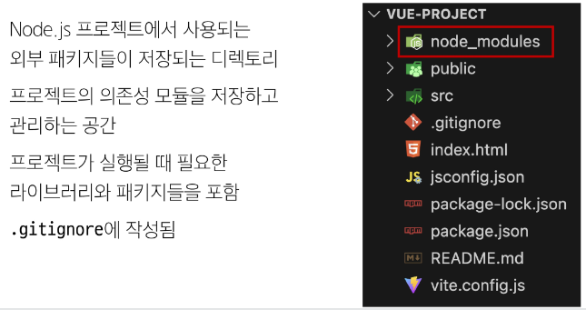

## pacage-lock.json
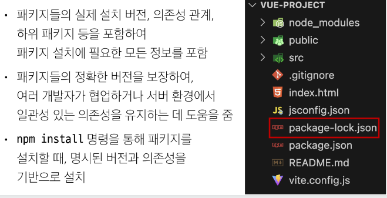

## package.jspon
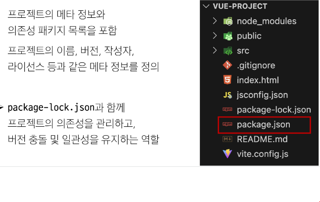

## public 디렉토리
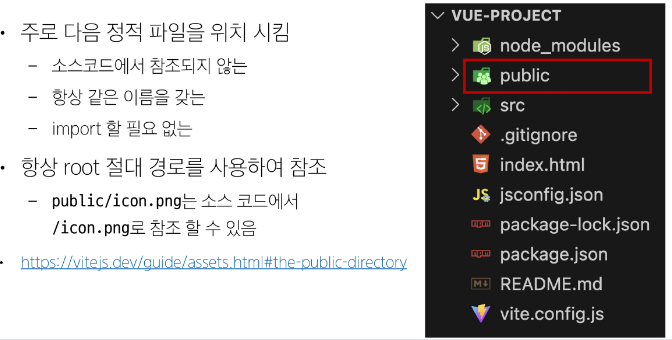

## src 디렉토리
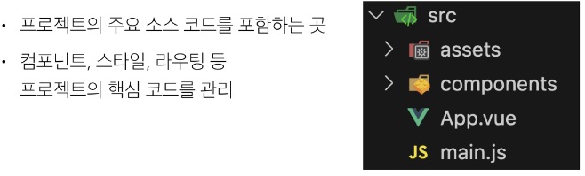

## src/assets
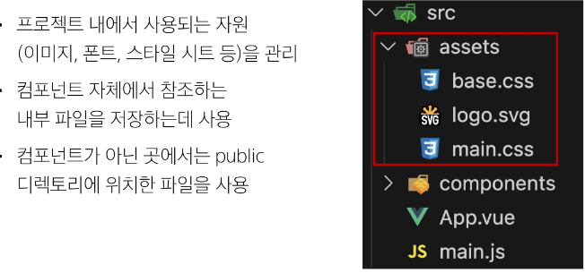

## src/compponents
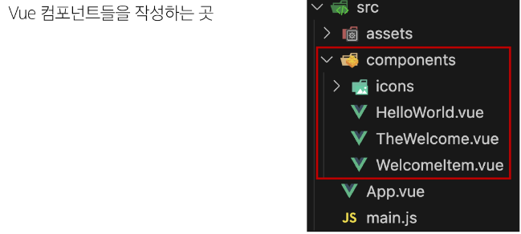

## src/App.vue
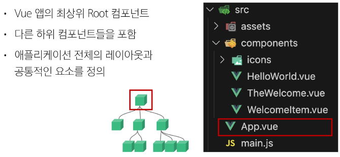

## src/main.js
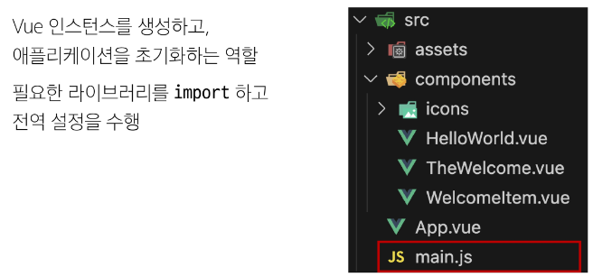

## 기타 설정 파일 
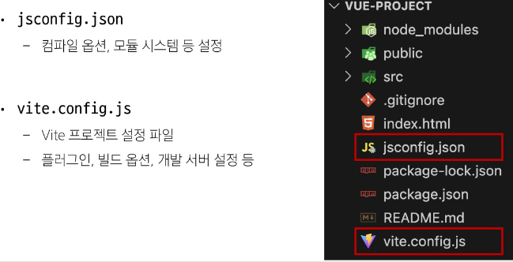

## Vue Component
## 사용 2단계
1. 컴포넌트 파일 생성
2. 컴포넌트 등록(import)

## Virtual DOM
- 가상의 DOM을 메모리에 저장하고 실제 DOM과 동기화하는 프로그래밍 개념
- 실제 DOM과의 변경사항 비교를 통해 변경된 부분만 실제 DOM에 적용
- 웹 으플리케이션의 성능을 향상시키기 위한 Vue의 내부 랜더링 기술
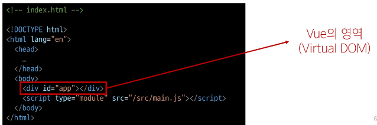

## 내부 랜더링 과정
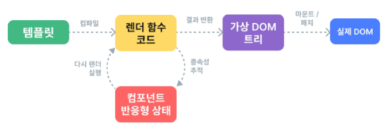

## 장점
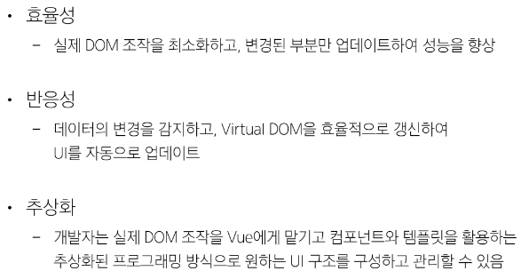
## 주의사항
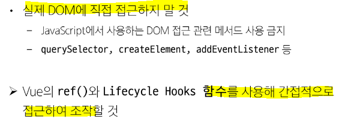

## 직접 DOM 엘리먼트에 접근해야 하는 경우
- ref 속성을 사용하여 특정 DOM 엘리멘트에 직접적인 참조를 얻을 수 있음
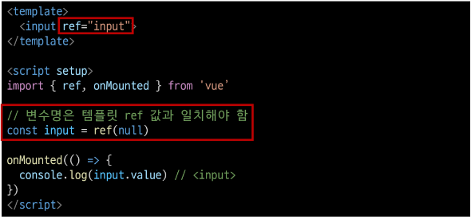

