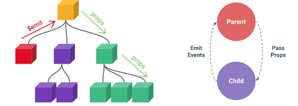
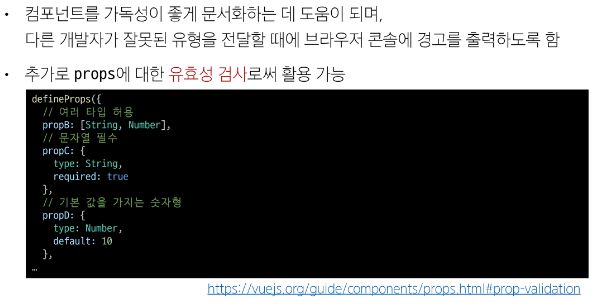

# [TIL] 2024-05-07

## Passing Props

- 부모는 자식에게 데이터를 전달(Pass Props)하며, 자식은 자신에게 일어난 일을 부모에게 알림(Emit Event)

## Props
- 부모 컴포넌트로부터 자식 컴포넌트로 데이터를 전달하는데 사용되는 속성

## Props 특징
- 부모 속성이 업데이트되면 자식으로 전달 되지만 그 반대는 안됨
- 즉, 자식 컴포넌트 내부에서 props를 변경하려고 이를 사용하는 자식 컴포넌트의 모든 props가 최신 값으로 업데이트 됨
- 부모 컴포넌트에서만 변경하고 이를 내려 받는 자식 컴포넌트는 자연스럽게 갱신

## One-Way Data Flow
- 모든 props는 자식 속성과 부모 속성 사이에 하향식 단방향 바인딩을 형성
(one-way-down-binding)

## 단방향인 이유
- 하위 컴포넌트가 실수로 상위 컴포넌트의 상태를 변경하여 앱에서의 데이터 흐름을 이해하기 어렵게 만드는 것을 방지하기 위함
- 데이터 흐름의 '일관성' 및 '단순화'

## Props 선언
- 부모 컴포넌트에서 내려 보낸 props를 사용하기 위해서는 자식 컴포넌트에서 명시적인 props 선언이 필요

## 작성

## 선언
- defineProps()를 사용하여 props를 선언
- defineProps()에 작성하는 인자의 데이터 타입에 따라 선언 방식이 나뉨

## 선언 2가지 방식
- 문자열 배열 
- 객체

## Props Name Casing

## static props & Dynamic props

## Props 활용
- v-for와 함께 사용하여 반복되는 요소를 props로 전달하기

## Emit

## 이벤트 발신 및 수신

## 정적 & 동적 props

- 첫 번째는 정적 props로 문자열 '1'을 전달
- 두 번째는 동적 props로 숫자 1을 전달

## Props 선언시 "객체 선언 문법"을 권장하는 이유

## emit 이벤트도 "객체 선언 문법"으로 작성 가능
