# [TIL] 2024-05-08

## Routing
- 네트워크에서 경로를 선택하는 프로세스
- 웹 애플리케이션에서 다른 페이지 간의 전환과 경로를 관리하는 기술

## SSR Routing
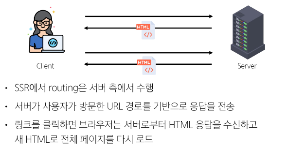

## CSR Routing
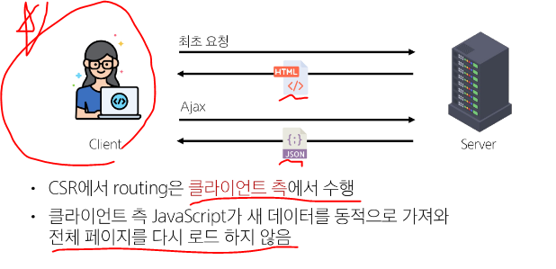

## SPA에서 Routing이 없다면
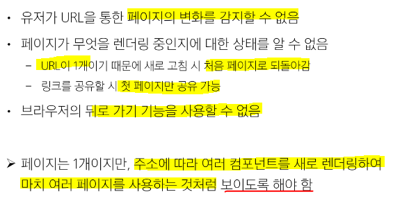

## Router Link
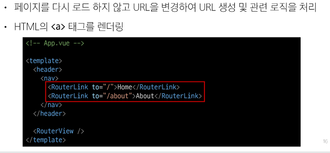

## Router View
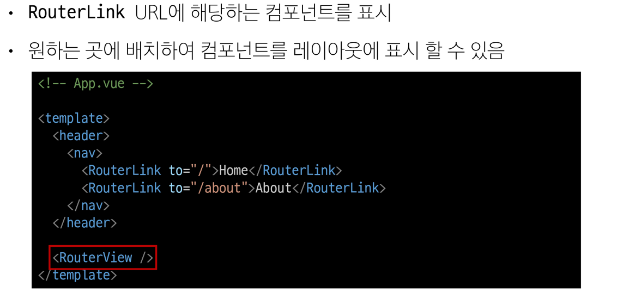

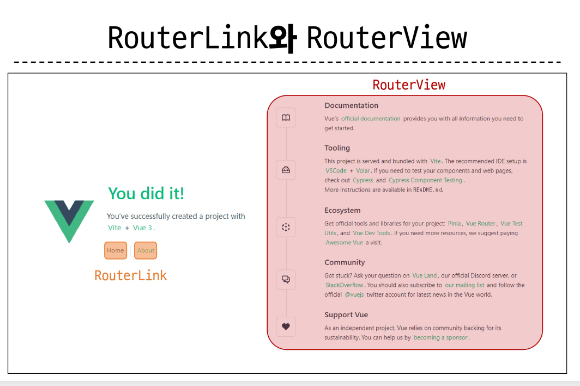

## router/index.js
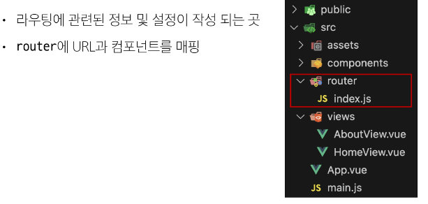

## views
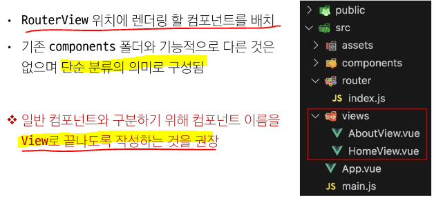

## 라우팅 기본
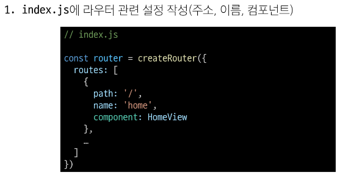
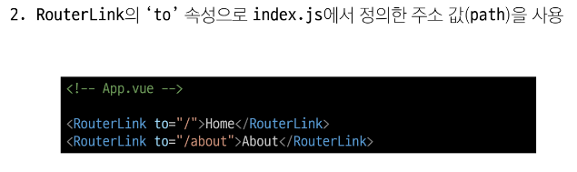
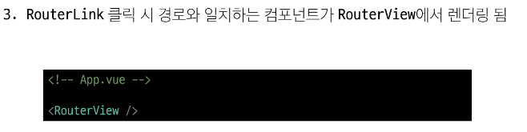

## Named Routes
- 경로에 이름을 지정하는 라우팅
## 예시
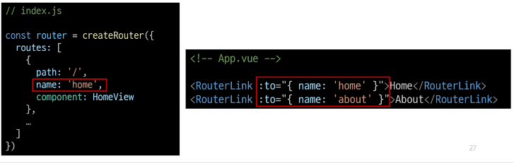
- name 속성 값에 경로에 대한 이름을 지정
- 경로에 연결하려면 RouterLink에 v-bind(':')를 사용해 'to' props  객체 로 전달

## 장점
- 하드 코딩된 url을 사용하지 않아도 된다.
- url 입력 시 오타 방지

## Dynamic Route Matching
- URL의 일부를 변수로 사용하여 경로를 동적으로 매칭

## 매개변수를 사용한 동적 경로 매칭
- 주어진 패턴 경로를 동일한 컴포넌트에 매핑 해야 하는 경우 활용
- 예를 들어 모든 사용자의 ID를 활용하여 프로필 페이지 URL을 설계하면?
    - user/1
    - user/2
    - user/3
    - 일정한 패턴의 URL 작성 반복
1. 
2. 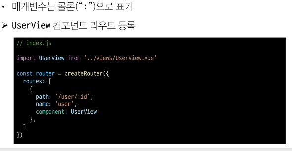
3. 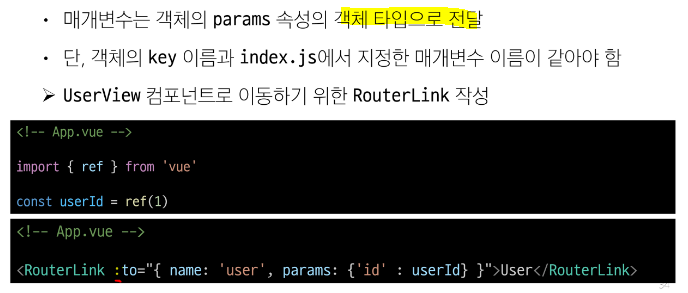
4. 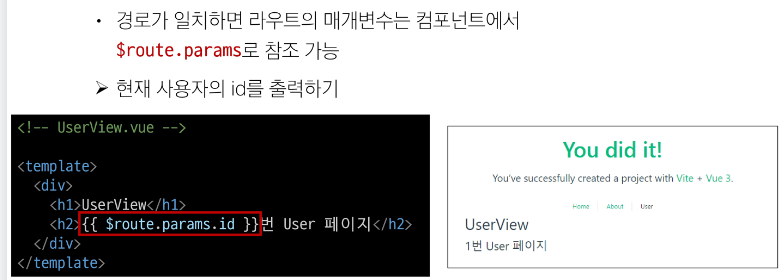
5. 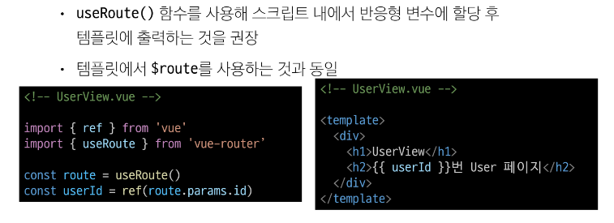

## Nested Routes
- 중첩된 라우팅
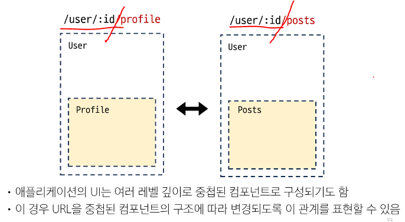

## Programmatic Navigation
- 프로그래밍으로 URL 이동하기
- router의 인스턴스 메서드를 사용해 RouterLink로 a 태그를 만드는 것 처럼 프로그래밍으로 네비게이션 관련 작업을 수행할 수 있음

## router의 메서드
1. 다른 위치로 이동하기
    - router.push()
2. 현재 위치 바꾸기
    - router.replace()

# router.push
- 다른 url로 이동하는 메서드
- 새 항목을 history stack에 push하므로 사용자가 브라우저 뒤로 가기 버튼을 클릭하면 이전 url로 이동할 수 있다.
(스택에 url들이 쌓인다.)
- RouterLink를 클릭했을 때 내부적을 호출되는 메서드 이므로 RouterLink를 클릭하는 것은 router.push를 호출하는 것과 같다.
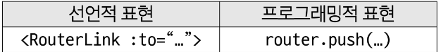

## router.replace
- push와 달리 history stack에 새로운 항목을 push 하지 않고 다른 URL로 이동(=== 이동 전 URL로 뒤로 가기 불가)
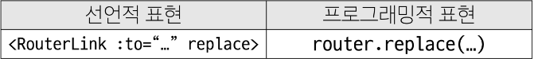

## Navigation Guard
- Vue router를 통해 특정 URL에 접근할 때
- 다른 URL로 redirect를 하거나 취소하여 내비게이션을 보호
- 라우트 전환 전/후 자동으로 실행되는 Hook

## ## Navigation Guard 종류
1. Globally(전역 가드)
    - 애플리케이션 전역에서 모든 라우트 전환에 적용되는 가드
2. Per-route(라우트 가드)
    - 특정 라우트에만 적용되는 가드
3. In-Component
    - 컴포넌트 내에서만 적용되는 가드

## Globally(전역 가드)
- 애플리케이션 전역에서 동작하는 가드 
- 종류
    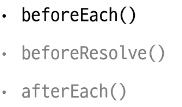

## router.beforeEach()
- 다른 URL로 이동하기 직전에 실행된는 함수
(Global Before Guard)
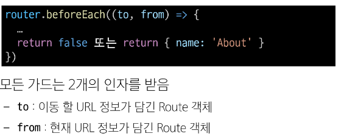
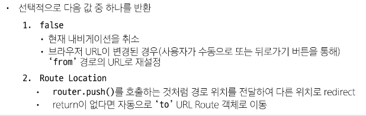
- return이 없다면 기본값은 to로 설정된다.
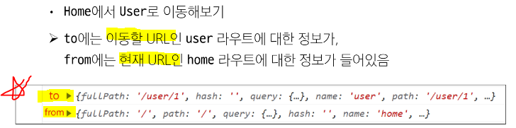

## Per-route Guard
- 특정 라우터에서만 동작하는 가드
- 작성 위치 : index.js의 각 routes
- 종류 
    - beforeEnter() - 해당 라우터에 들어가기 전에 발동

## router.beforeEnter()
- 특정 route에 진입했을 때만 실행되는 함수
- 단순희 URL의 매개변수나 쿼리 값이 변경될 때는 실행되지 않고, 다른 URL에서 탐색해 올 때만 실행됨

## In-component Guard
- 특정 컴포넌트 내에서만 동작하는 가드
- 작성위치 : 각 컴포넌트 "script" 문 내부

# 종류
- onBeforeRouteLeave()
    - 현재 라우트에서 다른 라우트로 이동하기 전에 실행
    - 사용자가 현제 페이지를 떠나는 동작에 대한 로직을 처리
- onBeforeRouteUpdate()
    - 이미 랜더링 된 컴포넌트가 같은 라우트 내에서 업데이트 되기 전에 실행
    - 라우트 업데이트 시 추가적인 로직을 처리

오프라인

{{route}} => 문자열 'route 출력' => 현재 활성화된 객체
{{$router}} => 애플리케이션 전체 단 1개, 전반적인 라우트들을 관리
이 각각 객체들의 프로퍼티, 메서드
$router.back() 뒤로가기
$router.path(경로) / params(파라미터들)

이동할 페이지 껍데기

component -> views에 그려질 친구들