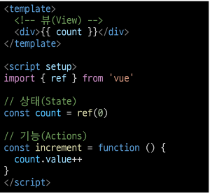
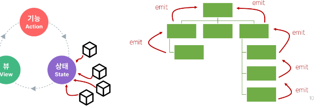
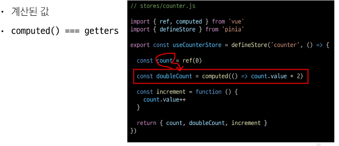
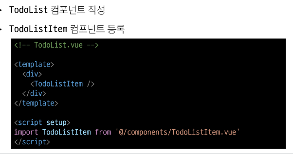

# [TIL] 2024-05-09

## State Management
- 상태관리
- Vue 컴포넌트는 이미 반응형 상태를 관리하고 있음
    - 상태 === 데이터

## 컴포넌트 구조의 단순화

- 상태(State)
    - 앱 구동에 필요한 기본 데이터
- 뷰(view)
    - 상태를 선언적으로 매핑하여 시각화
- 기능(Actions)
    - 뷰에서 사용자 입력에 대해 반응적으로 상태를 변경할 수 있게 정의된 동작
-> "단방향 데이터 흐름"의 간단한 표현


## 상태 관리의 단순성이 무너지는 시점
- 여러 컴포넌트가 상태를 공유할 때
    1. 여러 뷰가 동일한 상태에 종속되는 경우(같은 정보를 곳곳에서 뿌려주고 있는 경우)
    
        - 공유 상태를 공통 조상 컴포넌트로 끌어올린 다음 다음 props로 전달하는 것
        - 하지만 계층 구조가 깊어질 경우 비효율적, 관리가 어려워짐

    2. 서로 다른 뷰의 기능이 동일한 상태를 변경하는 경우
    
        - 발신된 이벤트를 통해 상태의 여러 복사본을 변경 및 동기화 하는 것
        - 마찬가지로 관리의 패턴이 꺠지기 쉽고 유지 관리할 수 없는 코드가 된다.
 ## 해결책

1. 각 컴포넌트의 공유 상태를 추출하여, 전역에서 참조할 수 있는 저장소에서 관리


2. 각 컴포넌트의 공유 상태를 추출하여, 전역에서 참조할 수 있는 저장소에서 관리


3. 

## Pinia 구성요소
1. store
2. state
3. getters
4. actions
5. plugin

## store 

## state

## getters

## actions

## Setup Stroes의 반환값

## plugin
- 애플리케이션의 상태 관리에 필요한 추가 기능을 제공하거나 확장하는 도구나 모듈
- 애플리케이션의 상태 관리를 더욱 간편하고 유연하게 만들어주며 패키지 매니저로 설치 이후 별도 설정을 통해 추가 됨

## 정리
- store라는 저장소를 가진다.
- store는 state, getters, actions으로 이루어지며 각각 ref(), computed(), function()과 동일함

## 구성요소 활용
## State
- 각 컴포넌트 깊이에 관계 없이 store 인스턴스로 state에 접근하여 직접 읽고 쓸 수 있음
- 만약 store에 state를 정의하지 않았다면 컴포넌트에서 새로 추가할 수 없음


## getters
- store의 모든 getters 또한 state처럼 직접 접근 가능


## Actions


## Todo Prj
### 사전준비
1. 
2. 
3. 
4. 
5. 
6. 


# 오프라인 수업
- 객체란 무엇인가?
    - 상태와 행동의 집합

-
```javascript
 const obj={
    age:5,
    newAge: () => {obj.age++} //-> 메서드(객체 안의 함수) 객체의, 프로퍼티 value가 함수 객체내의 상태를 변화시키는 함수
 }
```
