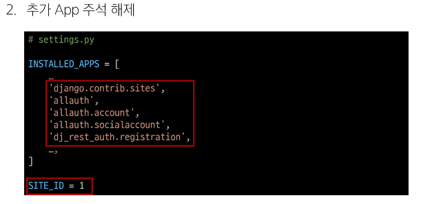

# [TIL] 2024-05-14
## Vue with DRF 2

## Authentication (인증)
- 수신된 요청을 해당 요청의 사용자 또는 자격 증명과 연결하는 메커니즘 
- 누구인지를 확인하는 과정

## Permissions (권한)
요청에 대한 접근 허용 또는 거부 여부를 결정

## 인증과 권한
- 순서상 인증이 먼저 진행되며 수신 요청을 해당 요청의 사용자 또는 해당 요청이 서명된 토큰과 같은 자격 증명 자료와 연결

- 그런 다음 권한 및 제한 정책은 인증이 완료된 해당 자격 증명을 사용하여 요청을 허용해야 하는 지를 결정

## DRF에서의 인증
- 인증은 항상 view 함수 시작시, 권한 및 제한 확인이 발생하기 전, 다른 코드의 진행이 허용되기 전에 실행됨

- 인증 자체로는 들오는 요청을 허용하거나 거부할 수 없으며, 단순히 요청에 사용된 자격 증명만 식별 한다는 점에 유의

## 승인되지 않은 응답 및 금지된 응답
- 인증되지 않은 요청이 권한을 거부하는 경우 해당되는 두 가지 오류 코드를 응답
1. HTTP 401 Unauthorized
- 요청된 리소스에 대한 유효한 인증 자격 증명이 없기 때문에 클라이언트 요청이 완료되지 않았음을 나타냄(누구인지를 증명할 자료가 없음)
2. HTTP 403 Forbidden(Permission Denied)
- 서버에 요청이 전달되었지만, 권한 때문에 거절되었다는 것을 의미
- 401과 다른 점은 서버는 클라이언트가 누구인지 알고 있음

## 인증 체계 설정
1. 전역 설정

2. View 함수 별 설정

## DRF가 제공하는 인증 체계

## TokenAuthentication
- token 기반 HTTP 인증 체계
- 기본 데스크탑 및 모바일 클라이언트와 같은 클라이언트-서버 설정에 적합
- 서버가 인증된 사용자에게 토큰을 발급하고 사용자는 매 요청마다 발급받은 토큰을 요청과 함께 보내 인증 과정을 거침

## 적용 과정
1. 인증 클래스 설정

2. INSTALLED_APPS 추가

3. Migrate 진행

4. 토큰 생성 코드 작성

## Dj-Rest-Auth
- 회원가입, 인증(소셜 미디어 인증 등), 비밀번호 재설정, 사용자 세부 정보 검색, 회원 정보 수정 등 다양한 인증 관련 기능을 제공하는 라이브러리

## Dj-Rest-Auth의 Registration(등록) 기능 추가 설정
1. 패키지 추가 설치 

2. 추가 App 주석 해제

3. 관련 설정 코드 주석 해제

4. 추가 URL 주석 해제

## Django Signals
- 이벤트 알림 시스템
- 애플리케이션 내에서 특정 이벤트가 발생할 때, 다른 부분에게 신호를 보내어 이벤트가 발생했음을 알릴 수 있음
- 주로 모델의 데이터 변경 또는 저장, 삭제와 같은 작업에 반응하여 추가적인 로직을 실행하고자 할 때 사용
  - 예를 들어, 사용자가 새로운 게시글을 작성할 때마다 특정 작업(이메일 보내기)등을 수행하려는 경우

## 환경 변수
- 애플리케이션의 설정이나 동작을 제어하기 위해 사용되는 변수

## 환경 변수의 목적
- 개발, 테스트 및 프로덕션 환경에서 다르게 설정되어야 하는 설정 값이나 민감한 정보(ex. API key)를 포함
- 환경 변수를 사용하여 애플리케이션의 설정을 관리하면, 다양한 환경에서 일관된 동작을 유지하면서 필요에 따라 변수를 쉽게 변경할 수 있음
- 보안적인 이슈를 피하고, 애플리케이션을 다양한 환경에 대응하기 쉽게 만들어 줌

## Vite에서 환경 변수를 사용하는 법
