# [TIL] 2024-03-06

# Web
- Web site, Web application 등을 통해 사용자들이 정보를 검색하고 상호 작용하는 기술

## Web site
- 인터넷에서 여러 개의 Web page가 모인 것으로, 사용자들에게 정보나 서비스를 제공하는 공간

## Web page
- HTML, CSS 등의 웹 기술을 이용하여 만들어진, "Web site"를 구성하는 하나의 요소
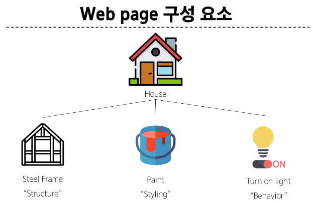
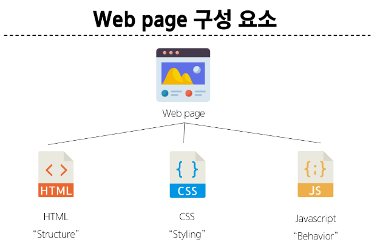

## HTML
- HyperText Markup Language
- 웹 페이지의 의미와 구조를 정의하는 언어

## HyperText
- 웹 페이지를 다른 페이지로 연결하는 링크
- 참조를 통해 사용자가 한 문서에서 다른 문서로 즉시 접근할 수 있는 테스트

## Markup Language
- 태그 등을 이용하여 문서나 데이터의 구조를 명시하는 언어
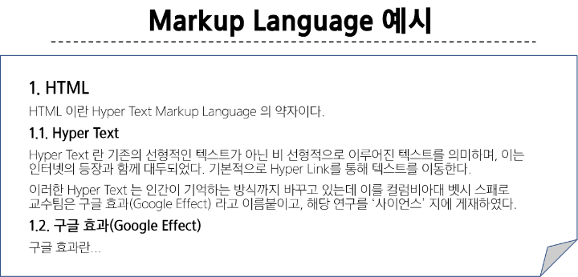
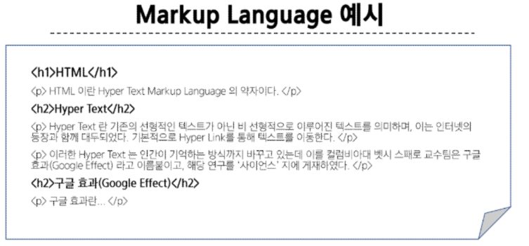

## HTML 문법 구조
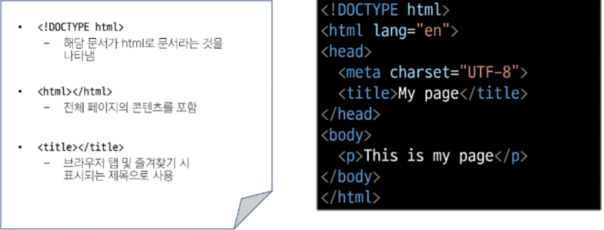
- head 부분은 사용자에게 보여지지 않는다.
- 페이지에 표시되는 모든 콘텐츠는 <body> 태그안에 위치한다.

## HTML Element(요소)
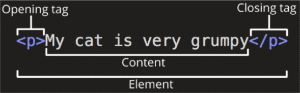
- 하나의 요소는 여는 태그와 닫는 태그 그리고 그 안의 내용으로 구성된다.
- 닫는 태그는 태그 이름 앞에 슬래시가 포함되며 닫는 태그가 없는 태그도 존재

## HTML Attributes(속성)
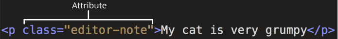
- 규칙
    - 속성은 요소 이름과 속성 사이에 공백이 있어야 함
    - 하나 이상의 속성들이 있는 경우엔 속성 사이에 공백으로 구분한다.
    - 속성 값은 열고 닫는 따옴표로 감싸야함
- 목적
    - 나타내고 싶지 않지만 *추가적인 기능*, 내용을 담고 싶을 때 사용
    - CSS에서 해당 *요소를 선택*하기 위한 값으로 활용됨


## h1태그
-h1 요소는 *단순히 텍스트를 크게 만드는 것이 아닌 현재 문서의 최상위 제목*이라는 의미를 부여하는 것

## CSS
- Cascading Style Sheet
- 웹 페이지의 디자인과 레이아웃을 구성하는 언어

### 인라인 스타일
- 태그 안에 style 속성 값으로 작성하는 것

### CSS Selectors(선택자)
- HTML 요소를 선태하여 스타일을 적용할 수 있도록 하는 선택자
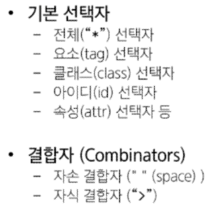
- *아이디 선택자 ("#")*
    - 주어진 아이디 속성을 가진 요소 선택
    - 주의할 것은 문서 내에서 주어진 id(동일한 이름의 id)는 하나여야 한다.(두번 쓴다고 오류가 발생하지는 않음)

### 명시도 - Specificity
- 결과적으로 요소에 적용할 CSS 선언을 결정하기 위한 알고리즘
- 선택자 중에 가중치를 계산하여 어떤 스타일을 적용할 지 결정
     - 동일한 요소를 가리키는 2개 이상의 CSS 규칙이 있는 경우 가장 높은
     명시도를 가진 선택자가 승리하여 스타일이 적용된다.
### 계단식 - Cascade
- 한 요소에 동일한 가중치를 가진 선택자가 적용될 때 CSS에서 마지막에 나오는 선언이 사용된다.
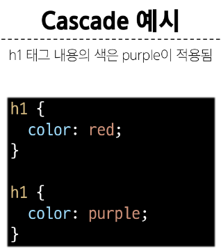
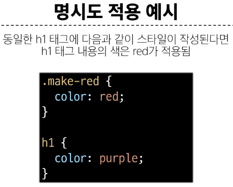

### 명시도 높은순
1. improtance
    - !important
2. Inline 스타일
3. 선택자
    - id 선택자 > class 선택자 > 요소 선택자
4. 소스 코드 선언 순서

### CSS 우선순위
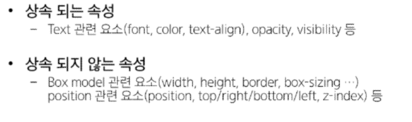

# 인라인, 블록구조 (중요)
1. 인라인(Inline)
2. 내부(Internal)
3. 외부(External)

```html
<style>
  div > span {
  color: red;
  }
</style>

<div>
  <h1>내가 집에 가고 싶은 이유</h1>
  <p>
    <span>피곤하기 때문에</span>
  </p>
  <div>
    <span>집에서 공부하면 효율이 더 좋아서 집가서 더 공부할거임</span>
  </div>
</div>
```

### 어트리뷰트(정적) <-> 프로퍼티(동적)

