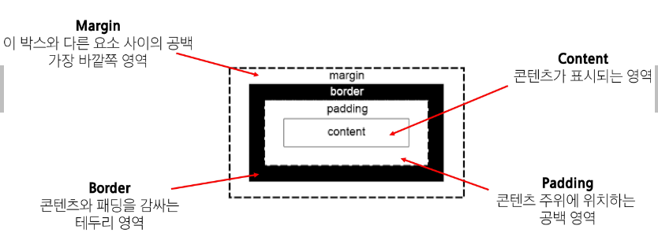
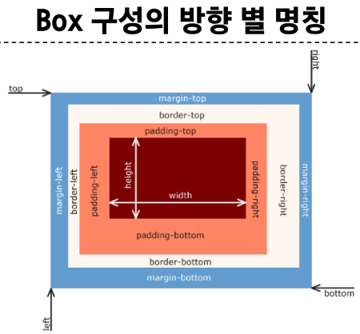
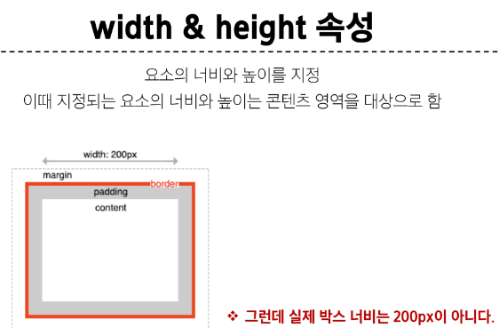
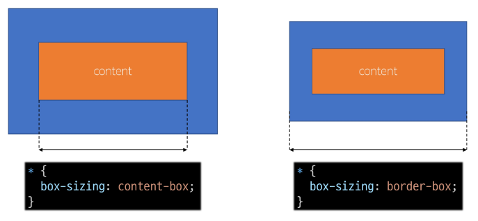
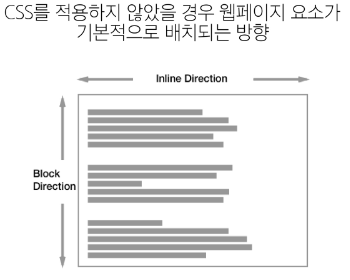
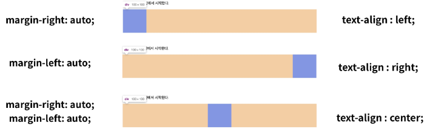
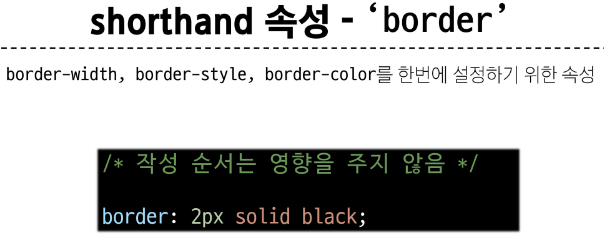
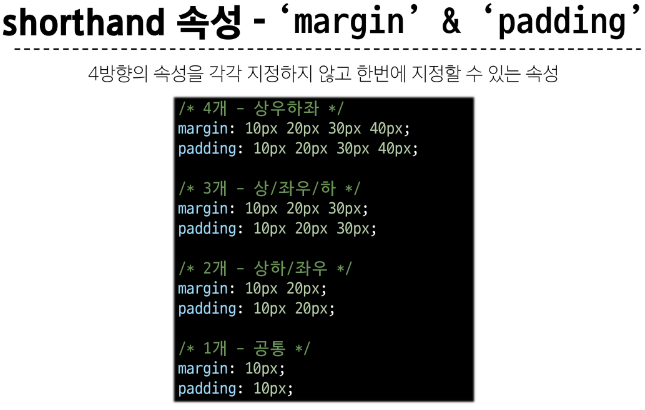
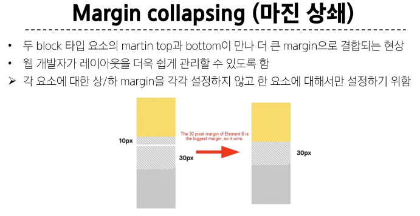

# [TIL] 2024-03-07

## CSS Box Model
- 모든 HTML 요소를 사각형 박스로 표현하는 개념
- 내용(content), 안쪽 여백(padding), 테두리(border), 외부 간격(margin)으로 구성

## Box 구성요소

## Box 구성의 방향 별 명칭

## width & height 속성

## CSS가 width 값을 계산하는 기준
- css는 border가 아닌 content의 크기를 width 값으로 지정한다.
- box-sizing 속성

- 왼쪽이 기본, 우리가 생각하는 테두리의 크기를 설정하려면 border-box로 설정해준다.
- 전체 선택자 사용

## 박스 타입
- block & Inline
- Nomal flow (좌상단 시작)
    
    - Inline : 좌상단->우측
    - Block : 좌상단 -> 하단
## Block 타입 특징
- 항상 새로운 행으로 나뉨
- width와 height 속성을 사용하여 너비와 높이를 지정할 수 있음
- 기본적으로 width 속성을 지정하지 않으면 박스는 inline 방향으로 사용 가능한 공간을 모두 차지함 ( 너비를 사용 가능한 공간의 100%로 채움)
- 대표적인 block 타입 태그
    - h1~6,p,div
## Inline 타입 특징
- 새로운 행으로 나뉘지 않음
- width와 height 속성을 사용할 수 없음
- 수직 방향
    - padding,margins,borders가 적용되지만 다른 요소를 밀어낼 수는 없음
- 수평 방향
    - padding,margins,borders가 적용되어 다른 요소를 밀어낼 수 있음
- 대표적인 inline 태그
    - a,img,span

## 속성에 따른 수평 정렬

## inline-block
- inline과 block 요소 사이의 중간 지점을 제공하는 display 값
- block 요소의 특징을 가진다.
    - width,height 속성 사용 가능
    - padding, margin, border로 인해 다른 요소가 밀려남
- 요소가 줄 바꿈 되는 것을 원하지 않으면서 너비와 높이를 적용하고 싶은 경우 사용
## none
- 요소를 화면에 표시하지 않고, 공간조차 부여되지 않음

## CSS Layout
- 각 요소의 위치와 크기를 조정하여 웹 페이지의 디자인을 결정하는 것
Display, Position, Flexbox 등등

### 포지션 유형
1. static
2. relative
3. absolute : 가장 가까운 부모요소 중, "static"이 아닌 부모 요소를 기준으로 배치된다.
4. fixed
5. sticky