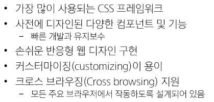
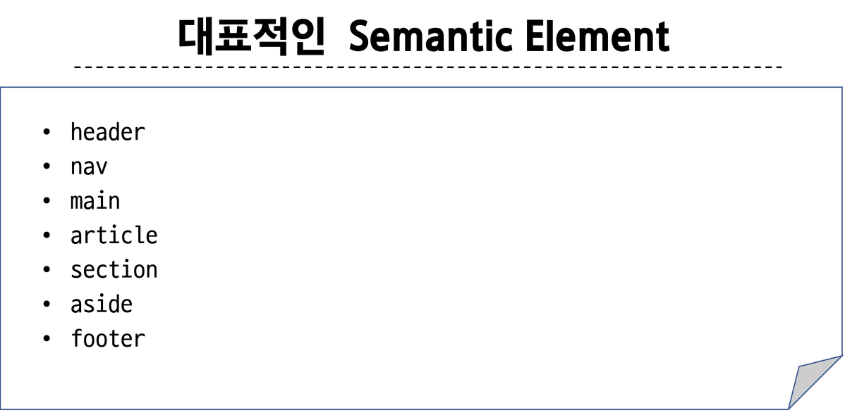

# [TIL] 2024-03-08

## Bootstrap
- CSS 프론트엔드 프레임워크(ToolKit)
- 미리 만들어진 다양한 디자인 요소들을 제공하여 웹 사이트를 빠르고 쉽게 개발할 수 있도록 함

### CDN
- 지리적 제약 없이 빠르고 안전하게 콘텐츠를 전송할 수 있는 기술
- 서버와 사용자 사이의 물리적인 거리를 줄여 콘텐츠 로딩에 소요되는 시간을 최소화 (웹 페이지 로드 속도를 높임)
- 지리적으로 사용자와 가까운 CDN 서버에 콘텐츠를 저장해서 사용자에게 전달

### Reset CSS
- 모든 브라우저는 각자의 'user agent stylesheet'를 가지고ㅓ 있음
- 모두 똑같은 스타일 상태로 만들고 개발을 시작하기 위함
- user agent stylesheet : 모든 문서에 기본 스타일을 제공하는 기본 스타일 시트

### Typography
- 제목, 본문 텍스트, 목록

### component
- 일관된 디자인을 제공하여 웹 사이트의 구성 요소를 구축하는 데 유용하다

### Bootstrap 사용이유

### Sementic Web
- 웹 데이터를 의미론적으로 구조화된 형태로 표현하는 방식
- 시험에 나옴

- flex : 부모요소 안에서 item들을 배치할 때 사용한다.
https://studiomeal.com/archives/197

= 주축을 기준으로 정렬한다.
    - justify-content : cneter, space-around, space-between 등등
- 교차축을 기준으로 정렬한다.
    - align-items : cneter 등등
- 여러행을 움직임
    - align-content : flex-start 등등
- flex-grow: flex-basis를 제외한 여백부분을 지정된 숫자의 비율로 나누어 배치