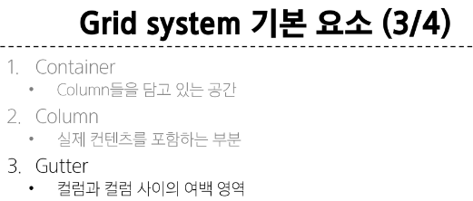
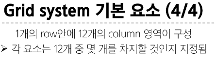

# [TIL] 2024-03-11

## 단축키
1. ctrl + l : 한줄 선택
2. ctrl + d : 동일한 키워드 연속 선택
3. ctrl + alt + 화살표 : 멀티커서
4. alt + 클릭 : 멀티 커서
5. alt + 화살표 : 선택한 라인 끌고가기
6. alt + shift + 화살표 : 방향으로 복사
## 반응형 웹
### Bootstrap Grid system
- 웹 페이지의 레이아웃을 조정하는 데 사용되는 12개의 컬럼으로 구성된 시스템
- Grid system의 목적
    - 반응형 디자인을 지원해 웹 페이지를 모바일, 태블릿, 데스크탑 등 다양한 기기에서 적절하게 표시할 수 있도록 도움

### 반응형 웹 디자인
- 디바이스 종류나 화면 크기에 상관없이, 어디서든 일관된 레이아웃 및 사용자 경험을 제공하는 디자인 기술




### 시험
- grid 갯수
- Offset
- 부트스트랩 중
    - CDN
    - Spacing
        - {Property} {sides} {}
    - background color -> 문법 
- 자식 부모, 자식을 중앙으로 옮기기

```html
<!DOCTYPE html>
<html lang="en">
<head>
    <meta charset="UTF-8">
    <meta name="viewport" content="width=device-width, initial-scale=1.0">
    <title>Document</title>
    <style>
    .parent {
    position: relative;
    width: 100px;
    height: 100px;
    background-color: black;
    /* display: flex;
    justify-content: center;
    align-items: center; */
    }

    .child {
    position: absolute;
    width: 10px;
    height: 10px;
    background-color: blue;

    /* top:45px;
    left:45px; */

    top:50%;
    left:50%;

    transform: translate(-50%, -50%);

    }

    </style>
</head>
<body>
    <div class="parent">
        <div class="child"></div>
    </div>
</body>
</html>
```