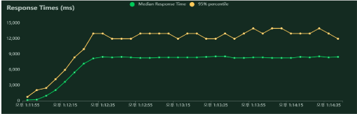
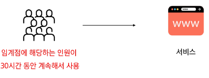
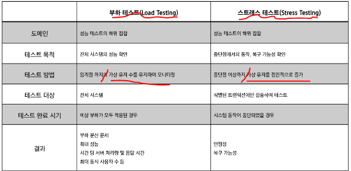
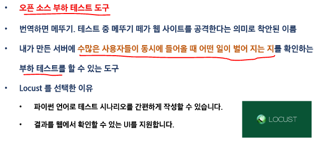
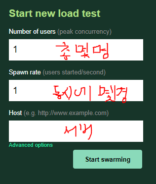
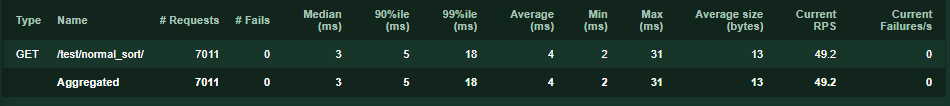

# [PJ] 2024-05-03
## 목표
- Locust라는 툴을 이용하면 사진과 같이 성능 테스트를 할 수 있다.

## 테스트란?
- 원하는 기능이 모두 구현되었는 지 확인하고, 숨겨져 있는 결함을 찾는 활동
- 여러가지 도구들을 활용하여 버그를 찾아내고 신뢰성, 보안, 성능 등을 검증하는 중요한 단계

## 성능 테스트
- 핵심 테스트 중 하나
- 특정 상황에서 시스템이 어느 정도 수준을 보이는가 혹은 어떻게 대처하는가를 테스트 하는 과정
- 목적
    - 테스트를 통해 성능 저하가 발생하는 요인을 발견하고 제거
    - 시장에 출시되기 전에 발생할 수 있는 위험과 개선사항을 파악
    - 안정적이고 신뢰할 수 있는 제품을 바르게 만들기 위함

## 부하 테스트

- 시스템에 임계점의 부하가 계속될 때 문제가 없는가?
- 목적 : 시스템의 신뢰도와 성능을 측정
- 임계점 -> 사용자 혹은 요청이 점점 늘어나다가, 응답시간이 급격히 늘어나는 시점

## 스트레스 테스트
- 시스템에 과부하가 오면 어떻게 동작할까?
- 목적 : 장애 조치와 복구 절차가 효과적이고 효율적인 지 확인

## 부하 VS 스트레스

## Locust

# 실행 결과

- 성공횟수
- 실패수
- 중앙값
- 응답시간
- 99%번째